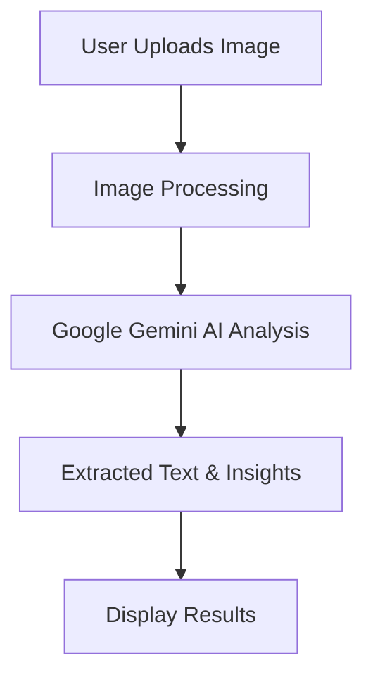

# 📸 Image Extractor LLM App

## 📝 Description

An advanced **Streamlit-based AI application** that extracts and understands text from images, especially invoices, using **Google Gemini AI**. This app allows users to upload an image and receive AI-generated insights about its content. Built with **Google Generative AI API**, it provides efficient and accurate text extraction and analysis.

## ✨ Features

- 📄 **Extracts Text from Invoices & Documents**
- 🤖 **Uses Google Gemini AI for Advanced Understanding**
- 📷 **Supports Image Uploads (JPG, JPEG, PNG)**
- 🔍 **Generates AI-Based Insights from Images**
- ⚡ **Fast & Efficient Processing**
- 🎯 **User-Friendly Streamlit Interface**

## 🚀 Getting Started

### Prerequisites

- Python 3.8 or higher
- Google API Key
- Git

### Installation

1. **Clone the repository**
```bash
git clone https://github.com/YOUR_USERNAME/image-extractor-llm.git
cd image-extractor-llm
```

2. **Create and activate virtual environment**
```bash
# Windows
python -m venv venv
venv\Scripts\activate

# Linux/Mac
python -m venv venv
source venv/bin/activate
```

3. **Install dependencies**
```bash
pip install -r requirements.txt
```

4. **Set up environment variables**
Create a `.env` file in the project root:
```plaintext
GOOGLE_API_KEY=your_google_api_key_here
```

5. **Run the application**
```bash
streamlit run app.py
```

## 💻 Usage

1. Upload an invoice or document image.
2. Enter a prompt to extract specific details.
3. Click **"Tell me about the image"**.
4. View AI-generated insights from the uploaded image.

## 🛠️ Technical Architecture



## 📂 Project Structure

```
image-extractor-llm/
├── app.py              # Main application file
├── .env                # Environment variables
├── requirements.txt    # Dependencies
├── README.md           # Documentation
```

## 🔮 Future Advancements

- 📝 **Multi-Language Text Extraction**
- 🔄 **Integration with OCR for Enhanced Accuracy**
- 🚀 **Support for Additional File Formats (PDF, TIFF, etc.)**
- 🎯 **More AI Models for Context-Based Understanding**
- 📊 **Advanced Data Insights & Export Options**

## 🤝 Contributing

1. Fork the repository
2. Create your feature branch (`git checkout -b feature/AmazingFeature`)
3. Commit your changes (`git commit -m 'Add some AmazingFeature'`)
4. Push to the branch (`git push origin feature/AmazingFeature`)
5. Open a Pull Request

## 🙏 Acknowledgments

- **Google Gemini AI** for AI-based text extraction
- **Streamlit** for the interactive UI
- **PIL** for image processing

---

This README now clearly documents your **Image Extractor LLM App**. Let me know if you need any modifications! 🚀

